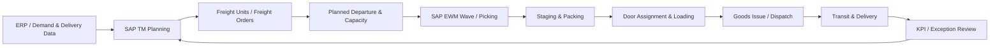

# SAP TM–EWM Operational Flow

The key integration principle is that transportation planning should drive realistic warehouse cut-off, staging and loading timing, while warehouse execution status confirms whether the planned shipment is actually ready to depart.
