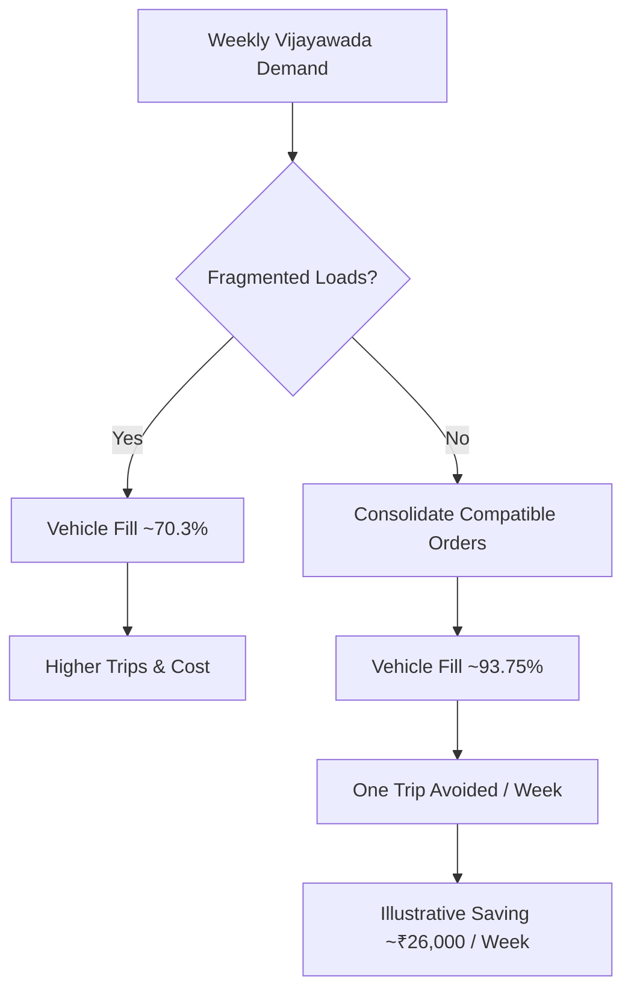

# Transport Consolidation Example

The example demonstrates how transportation consolidation can improve asset utilization without changing customer demand. The values are illustrative and are used only for the internship simulation.
